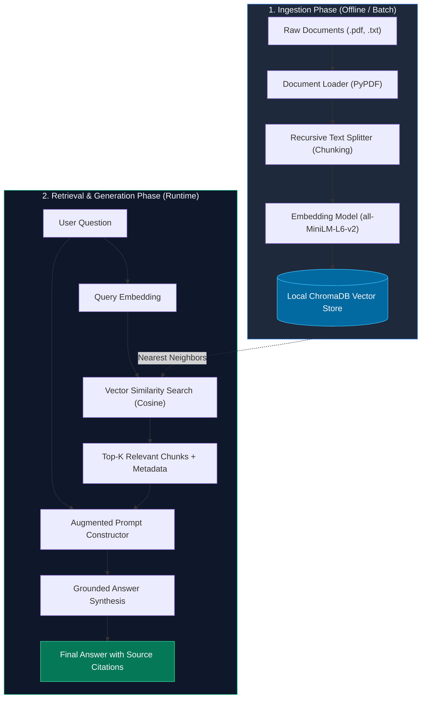

# 🧠 DSA RAG Tutor - Local & Cloud RAG Studio

> **100% Free, Offline, Local & Cloud Implementation**  
> Built with **ChromaDB**, **Sentence-Transformers (ONNX)**, **FastAPI**, and **PyPDF**.  
> **Zero API keys required • Zero costs • 100% Free.**

---

## 📚 Table of Contents
1. [What is RAG? (The Intuitive Explanation)](#1-what-is-rag)
2. [Why Do We Need RAG? (The 4 Core Problems Solved)](#2-why-do-we-need-rag)
3. [The 5 Core Stages of RAG](#3-the-5-core-stages-of-rag)
4. [Step-by-Step Architecture Diagram](#4-architecture-diagram)
5. [How to Run Your Free Local RAG System](#5-how-to-run-locally)
6. [Top Interview Questions & Answers on RAG](#6-top-interview-questions--answers)
7. [Advanced Optimization Patterns (For Production)](#7-advanced-rag-patterns)

---

## 1. What is RAG?

**RAG** stands for **Retrieval-Augmented Generation**.

### The "Open-Book Exam" Analogy
Imagine taking a difficult medical board exam:
- **Standard LLM (Closed-Book)**: You must answer every question from your own memory. If you haven't memorized a new 2026 research paper, or if you misremember details, you will guess or make up facts (**hallucination**).
- **RAG (Open-Book)**: When you are asked a question, you first look up the relevant chapter in the library (**Retrieval**), open the exact page (**Augmentation**), and write your answer based strictly on what that page says (**Generation**).

RAG combines the **information retrieval power of search engines & vector databases** with the **reasoning and fluent language generation of LLMs**.

---

## 2. Why Do We Need RAG?

| Problem with Vanilla LLMs | How RAG Solves It |
| :--- | :--- |
| **Knowledge Cutoff**: LLMs only know data up to their training date. | RAG queries live, updated documents in real-time without retraining. |
| **Hallucinations**: When LLMs don't know an answer, they fabricate plausible-sounding falsehoods. | RAG restricts the LLM to answer **only** using retrieved factual excerpts. |
| **Context Window & Cost Limits**: You cannot paste thousands of company PDFs into a single prompt. | RAG only fetches the top 3-5 relevant paragraphs (under 1,000 tokens), saving massive cost & latency. |
| **Data Privacy & Security**: Enterprises cannot upload confidential internal code or customer data to public model training pipelines. | Documents stay in a local or private vector database (like ChromaDB). |
| **Fine-Tuning is Expensive & Static**: Fine-tuning an LLM costs thousands of dollars and still suffers from knowledge obsolescence. | RAG allows updating knowledge in milliseconds by simply adding or deleting files in the vector DB. |

---

## 3. The 5 Core Stages of RAG

### Stage 1: Document Ingestion (Loading)
- **What it does**: Reads unstructured documents from various formats (`.pdf`, `.txt`, `.md`, `.docx`, web pages).
- **Why we need it**: In this project, `pypdf` extracts clean raw text streams from PDF pages, while standard UTF-8 handles text and markdown files.

### Stage 2: Chunking (Text Splitting)
- **What it does**: Divides long documents into smaller text pieces (e.g. 400 characters) with an overlap (e.g. 80 characters).
- **Why we need it**:
  1. **Embedding Capacity**: Embedding models have maximum token limits.
  2. **Information Density**: If you embed a 50-page document into one vector, the specific detail you need gets diluted. Small chunks create focused vectors.
  3. **Chunk Overlap**: Overlapping chunks ensure that a sentence split across a boundary does not lose its semantic meaning.
- **Tool used**: `RecursiveCharacterTextSplitter` — splits by paragraphs (`\n\n`), then sentences (`\n`), then spaces (` `), keeping semantic units intact.

### Stage 3: Embedding (Vectorization)
- **What it does**: Translates human text into an array of mathematical numbers (e.g. 384 dimensions) representing its semantic meaning.
- **How it works**: Words or sentences with similar meanings (e.g. "laptop battery issue" and "MacBook power drain") end up close together in mathematical space.
- **Model used**: `all-MiniLM-L6-v2` ONNX — runs 100% locally and free on your Mac M1!

### Stage 4: Vector Storage & Indexing (ChromaDB)
- **What it does**: Stores the chunk text, its embedding vector, and metadata (filename, chunk index) on disk.
- **Why we need it**: Traditional SQL databases search by exact keyword matches (`WHERE text LIKE '%return%'`). Vector databases perform **Approximate Nearest Neighbor (ANN)** searches using **Cosine Similarity**, understanding intent and synonyms even if the exact keywords differ.

### Stage 5: Retrieval & Augmented Prompt Generation
- **What it does**:
  1. Converts user question into a vector embedding.
  2. Queries ChromaDB for the Top-$K$ closest matching chunks.
  3. Injects the retrieved chunks into a structured prompt:
  ```text
  System: Answer strictly using ONLY the following context.
  Context: [Retrieved chunk 1, chunk 2...]
  Question: [User query]
  Answer:
  ```
  4. Passes this prompt to the generation layer to produce a factual, cited response.

---

## 4. Architecture Diagram



---

## 5. How to Run Locally

### Directory Structure
```
rag-from-scratch/
├── sample_docs/
│   ├── company_ai_policy.txt       # Sample enterprise manual
│   └── enterprise_guide.pdf        # Real sample PDF document
├── rag_engine.py                   # Core RAG engine implementation
├── test_rag.py                     # Automated verification suite
├── interactive_cli.py              # Interactive terminal explorer
└── README.md                       # Architecture & interview guide
```

### 1. Run Automated Test Suite
Verify ingestion, PDF reading, vector storage, and query answering:
```bash
cd /Users/swapnilshende/.gemini/antigravity-ide/scratch/rag-from-scratch
python3 test_rag.py
```

### 2. Run Interactive Terminal Chat
Chat with your documents in real time:
```bash
python3 interactive_cli.py
```
- Type any question (e.g. `What is the refund period?`, `What are the rate limits?`)
- Add your own PDF or TXT files on the fly: `add /path/to/my_file.pdf`
- Inspect indexed chunk statistics: `stats`
- Exit anytime: `exit`

---

## 6. Top Interview Questions & Answers on RAG

Here are the questions interviewers frequently ask for GenAI and Machine Learning roles:

### Q1: What is the difference between RAG and Fine-Tuning?
- **RAG**: Best for injecting dynamic, up-to-date, or proprietary facts. Low cost, instant updates, full traceability (citations), zero hallucination on unknown queries.
- **Fine-Tuning**: Best for changing the *style*, *tone*, *vocabulary*, or *domain syntax* (e.g. medical terminology, SQL generation). It is costly, slow to update, and prone to hallucinations when asked about facts.
- **Rule of Thumb**: *RAG is for knowledge; Fine-tuning is for form and style.*

### Q2: What happens if your chunk size is too small or too large?
- **Too Small (e.g. 50 characters)**: Loses context and grammatical structure. The embedding vector lacks sufficient semantic signal.
- **Too Large (e.g. 4000 characters)**: Dilutes the specific answer among irrelevant text ("needle in a haystack"). May exceed the context window or token limits.
- **Sweet Spot**: Usually 300 to 800 characters (or 100-250 tokens) with 10-20% overlap.

### Q3: How do you prevent hallucinations in a RAG system?
1. **Relevance Thresholding**: If the highest cosine similarity score is below a threshold (e.g., < 0.65), decline to answer rather than guessing.
2. **Strict System Prompt**: Instruct the model: *"Answer strictly using only the provided context. If the answer is not contained, say 'I don't know'."*
3. **Low Temperature**: Set generation temperature to `0.0` or `0.1` for deterministic, fact-bound generation.
4. **Source Citations**: Require the model to quote chunk IDs or page numbers for every assertion.

### Q4: What is the difference between Dense Retrieval and Sparse Retrieval?
- **Sparse Retrieval (e.g. BM25, TF-IDF)**: Matches exact keywords, acronyms, and product codes. Great for exact part numbers (e.g. "XF-902"), but fails if the user uses synonyms.
- **Dense Retrieval (Embeddings, Vector Search)**: Understands semantic intent and concepts even without shared words (e.g. "car battery dead" matches "vehicle power drained").
- **State-of-the-Art (Hybrid Search)**: Combines Dense (Vectors) + Sparse (BM25) with Reciprocal Rank Fusion (RRF).

### Q5: What is "Lost in the Middle"?
Research shows that LLMs pay high attention to the beginning and end of a context prompt, but frequently overlook facts placed in the middle of long prompts.  
**Mitigation**: Reorder retrieved chunks to place the most critical chunks at the top and bottom of the prompt, or limit $K$ to only high-relevance chunks.

---

## 7. Advanced RAG Patterns (For Production)

1. **Reranking (Cross-Encoders)**: First retrieve top-20 chunks using fast bi-encoder vector search, then use a heavier Cross-Encoder model to accurately score and pick the top-3.
2. **Metadata Filtering**: Filter by tenant ID, user role, document date, or category before performing vector distance calculation.
3. **Parent-Document Retrieval**: Search small chunks (to get accurate embeddings), but return the larger surrounding parent document paragraph to the LLM for richer context.
4. **Agentic RAG (Self-Correction & Query Rewriting)**: An agent evaluates whether the retrieved context was sufficient. If not, it rewrites the search query and searches again.
